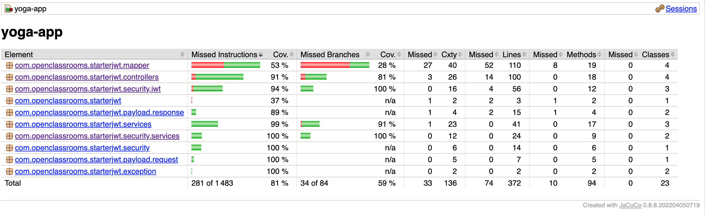
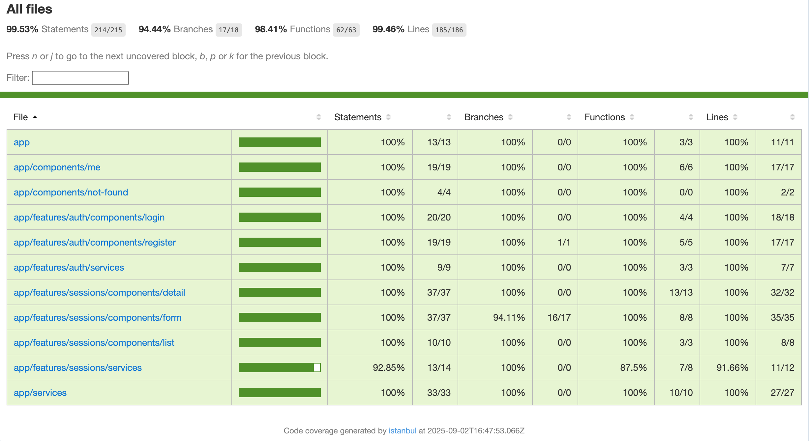
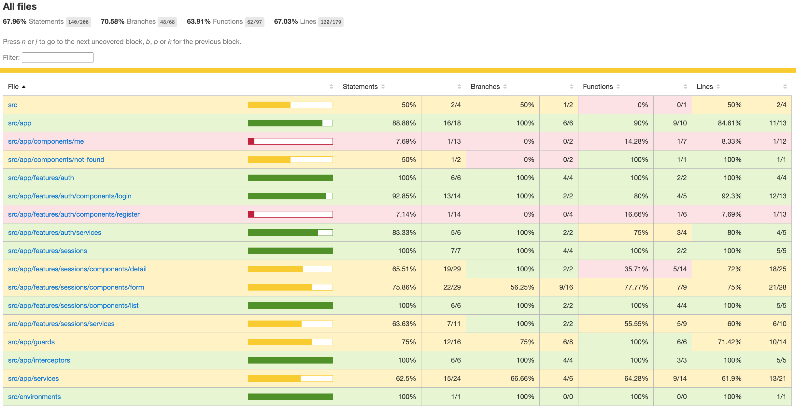

# Yoga App - Full Stack Testing

## 🧘‍♀️ Description

Full-stack yoga session management app with authentication system.

- **Frontend**: Angular 19
- **Backend**: Spring Boot 2.6.1 + Spring Security + JWT
- **Database**: MySQL
- **Testing**: Unit, integration, and end-to-end tests

---

## ✅ Prerequisites

- **Node.js** 16+ and npm
- **Java** 17+
- **Maven** 3.6+
- **MySQL** 8+
- **Angular CLI**:

  npm install -g @angular/cli

## 🚀 Installation

#### 1. Clone the project

git clone https://github.com/AnhVaccari/yoga-app
`cd yoga`

#### 2. MySQL Database

**Connect to MySQL**
mysql -u root -p

**Create the database**
CREATE DATABASE yoga;

**Import the SQL script**
mysql -u root -p yoga < ressources/sql/script.sql

**Default admin account :**

- Login: yoga@studio.com
- Password: test!1234

#### 3. Backend (Spring Boot)

`cd back`
`mvn clean install`

#### 4. Frontend (Angular)

`cd front`
`npm install`

## ▶️ Run the Application

##### Backend

`cd back`
`mvn spring-boot:run`

- **API available at :** http://localhost:8080

##### Frontend

`cd front`
`ng serve`

- **App available at :** http://localhost:4200

## 🧪 Testing

##### Backend

- **Unit & integration tests**
  `cd back`
  `mvn clean test`

###

- **Coverage report (JaCoCo)**
  `mvn clean test`

##### Frontend

- **Unit tests**
  `cd front`
  `npm run test`

###

- **Watch mode**
  `npm run test:watch`

###

- **End-to-End (E2E) tests**
  `npm run e2e`

###

- **E2E coverage**
  `npm run e2e:coverage`

###

## Coverage Reports

#### Backend (JaCoCo)

- **Localisation :** back/target/site/jacoco/index.html

##

#### Frontend (Jest)

#### End-to-End (Cypress)

## Resources

- #### Mockoon (Mock API)

  **Mock environment available in** resources/mockoon/

- #### Postman
  **Collection available at :** resources/postman/yoga.postman_collection.json
  **Import into Postman :** https://learning.postman.com/docs/getting-started/importing-and-exporting-data/#importing-data-into-postman

## Technologies

#### Backend

- Spring Boot 2.6.1
- Security + JWT
- Spring Data JPA
- MySQL
- Maven
- JUnit 5 + Mockito

#### Frontend

- Angular 19
- Cypress (E2E)
- Jest (Unit tests)
